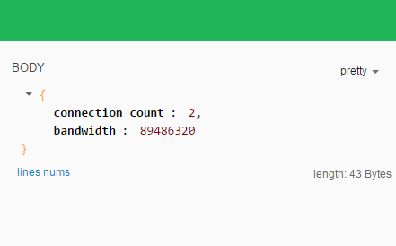

## mod_mystatus
> An apache(httpd) status module that really realtime, I just handle to output specific url connection count and bandwidth.

### Dependency
[cJSON](https://github.com/DaveGamble/cJSON), Ultralightweight JSON parser in ANSI C 

### Compilation && Install
#### Linux
* Compilation

    ```python 

    # I have built a static lib if you use CentOS 7, use it.
    apxs -c mod_mystatus.c -Ilinux/cJSON -Llinux/cJSON -lcjson -lm
    # or
    # You can build cJSON.c when build mod_mystatus.c, but mod_mystatus.c should be at first location.
    apxs -c mod_mystatus.c linux/cJSON/cJSON.c -Ilinux/cJSON -lm 

    ```
* Install

    ```python
    [sudo] apxs -i -a mod_mystatus.la
    ```
* Configuration

    Just add the following content into httpd.conf 
    ```python
    <Location "/mystatus">
        SetHandler mystatus-handler
    </Location>
    ```

#### Windows
* Configure apxs
 - Install perl

     Go to [activestate](http://www.activestate.com/activeperl) to download **activeperl**.

     Double click and next to install.

 - Install apxs

     Go to [apachelounge](http://www.apachelounge.com/download/apxs_win32.zip) to download **apxs_win32.zip**.

     Extract it into *[your path]\apxs*.

     Open **VS201X developer command interpreter** and change dir to *[your path]\apxs*.

     Execute *perl Configure.pl --with-apache2=[your apache root path] --with-apache-prog=httpd.exe*.

     Modify *[your apache root path]\build\config_vars.mk*: 

     ```python
     CC = cl.exe
     LD = link.exe

     CFLAGS = /nologo /MD /W3 /O2 /D WIN32 /D _WINDOWS /D NODEBUG /I"[your mod_mystatus path]\windows\cJSON" /I"[your mod_mystatus path]\windows\pcre-8.33\inc"
     # You should use /machine:X86 and /libpath:"[your mod_mystatus path]/windows/pcre-8.33/lib" if your OS is 32 bit.
     LDFLAGS = kernel32.lib pcreposix3.lib /nologo /subsystem:windows /dll /machine:x64 /libpath:"[your apache root path]\lib" /libpath:"[your mod_mystatus path]\windows\pcre-8.33\lib\x64"
     ```
     Add *[your apache root path]\bin* into your windows system path.

* Compilation && Install
    ```python
    apxs -c -i -a mod_mystatus.c -Iwindows/cJSON -Lwindows/cJSON libapr-1.lib libaprutil-1.lib libapriconv-1.lib libhttpd.lib
    # copy pcre3.dll and pcreposix3.dll in [your mod_mystatus path]\pcre-8.33  to [your apache root path]\bin.
    ```

* Configuration

    Just add the following content into **httpd.conf**

    ```python
    <Location "/mystatus">
        SetHandler mystatus-handler
    </Location>
    ```
### Usage

    Use http client to send a post request to *http://[your ip]/mystatus*, request content is a json string, it contains a request regex expression, as following:

    ```javascript
    {
        "pattern": "^/a.avi$"
    }
    ```

### Screenshot

